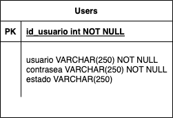

# CRUD Node Express

## Ejecucion Local
Para ejecutar el CRUD de manera local se debe empezar por instalar los modulos de node para ello empezamos por

```bash
npm install
```

### Configuracion de base de datos
Despues de que los modulos se instalen se debe ingresar a el directorio database y configurar sus propios valores de base de datos

### Ejecucion
Al terminar esto se puede pasar a correr el programa con
```bash
node app.js
```

## Ejecucion en contenedor Docker
Si desea mejor tener el programa gestionado en un contenedor una opcion es utilizar docker, para ello estan los dos archivos dockerfile y docker-compose

#### Dockerfile
Es el archivo donde esta configurado el entorno de Docker juntos con las dependencias necesarias. En este caso ya estaria configurado

#### Docker-compose
Docker Compose es el archivo donde este definido los múltiples contenedores. Esta simplificado el proceso de definición, configuración y ejecución de aplicaciones que constan de varios servicios interconectados.

### Uso de docker
En primero te recomiendo tener docker para poder trabajar con lo siguiente sino lo tienes descargalo aca: https://www.docker.com/products/docker-desktop/

Para que docker identifique los contenedores recordar los archivos anteriormente nombrados, dentro tienen la configuracion de puertos, servicios requeridos, y como instalar las depencias. Para subir el contenedor y se quede en docker se debe utilizar el siguiente comando en la terminal
```bash
docker compose up --build
```

Aclaracion esto es para MAC Intel
Si por casualidad tienes docker descargado, pero al ingresar el comando te muestra que no entiende los comandos de docker puedes ingresar esto:
```bash
export PATH="/Applications/Docker.app/Contents/Resources/bin:$PATH"
```

## Base de datos
Para la creacion de la base de datos se utilizo la siguiente entidad



Como se manejo desde docker se usaron los comandos basicos por lo que para crear la base de datos se crea de la siguiente manera
```bash
CREATE DATABASE pruebasCode;

USE pruebasCode;

CREATE TABLE users (
    id_usuario int AUTO_INCREMENT PRIMARY KEY,
    usuario VARCHAR(250) NOT NULL,
    contrasea VARCHAR(250) NOT NULL,
    estado VARCHAR(250)
);

('john_doe', 'jd2023', 'activo'),
('maria_smith', 'ms456', 'activo'),
('juan_perez', 'jp789', 'inactivo'),
('laura_garcia', 'lg123', 'activo'),
('carlos_ruiz', 'cr567', 'inactivo'),
('ana_rodriguez', 'ar890', 'activo'),
('pedro_martinez', 'pm234', 'activo'),
('sara_lopez', 'sl567', 'inactivo'),
('javier_gomez', 'jg098', 'activo'),
('luisa_hernandez', 'lh321', 'activo');
```

Con todo lo anterior deberia trabajar normalmente.

Se puede continuar con las pruebas.

## Postman
En ambos casos se puede utilizar postman para realiza las peticiones, la documentacion e informacion sobre como realizarlas estan en el siguiente link: https://documenter.getpostman.com/view/33275918/2sA2rGvKh9